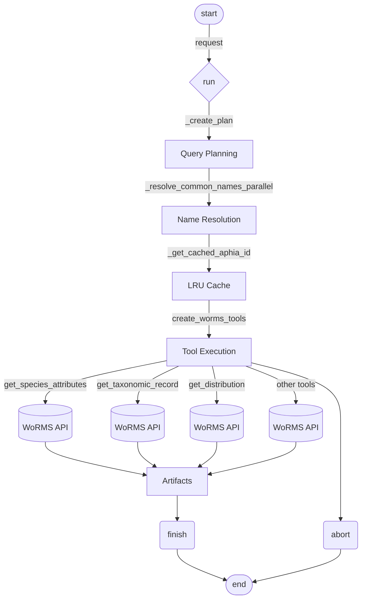

# WoRMS Marine Agent

A marine species research agent built with iChatBio SDK that queries the WoRMS database.

## Background

This agent makes marine species research easier by connecting to the World Register of Marine Species (WoRMS)—an authoritative database with taxonomic and ecological data for over 240,000 marine organisms. Built with the iChatBio SDK, it intelligently retrieves information like taxonomy, distribution, conservation status, and ecological traits based on your query.

## How It Works



## Technical Overview

The agent uses a **ReAct (Reasoning + Acting)** architecture powered by GPT-4o-mini. When a query arrives, it first analyzes what information is needed and creates an execution plan. Species names are resolved in parallel using WoRMS's fuzzy matching API, converting common names to scientific names and caching the results.

The agent then autonomously selects and executes the appropriate tools from 14 available options—ranging from fetching conservation status to retrieving geographic distributions. Tool calls are cached to avoid redundant API requests. All data is returned as structured JSON artifacts, making it easy to process programmatically or review directly.

**Key Technologies:**
- **LangChain & LangGraph**: Tool orchestration and ReAct agent framework
- **iChatBio SDK**: Agent communication and artifact management  
- **WoRMS REST API**: Marine species data source
- **GPT-4o-mini**: Query planning and tool selection
- **cloudscraper**: HTTP client with anti-bot protection

## Getting Started

### Local Development

```bash
# Create virtual environment
python3 -m venv venv
source venv/bin/activate  # On Windows: venv\Scripts\activate

# Install dependencies
pip install -r requirements.txt

# Configure environment variables
# Create a .env file with:
# OPENAI_API_KEY=your_openai_api_key_here

# Run the agent
python -m src.main
```

The agent will start on `http://localhost:9999`

## Available Tools

The agent includes 14 specialized tools:
- `get_species_attributes` - Conservation status, IUCN, CITES, body size, ecological traits
- `get_taxonomic_record` - Basic taxonomy (family, order, class)
- `get_species_distribution` - Geographic distribution and range
- `get_taxonomic_classification` - Full taxonomic hierarchy
- `get_species_synonyms` - Alternative scientific names
- `get_vernacular_names` - Common names in different languages
- `search_by_common_name` - Convert common names to scientific
- `get_literature_sources` - Scientific references and citations
- `get_child_taxa` - Child species under a taxonomic group
- `get_external_ids` - Cross-references to FishBase, NCBI, etc.
- `get_attribute_definitions` - Available WoRMS data categories
- `get_attribute_value_options` - Possible values for attributes
- `get_recent_species_changes` - Species added/modified in a date range
- `abort` / `finish` - Termination controls
